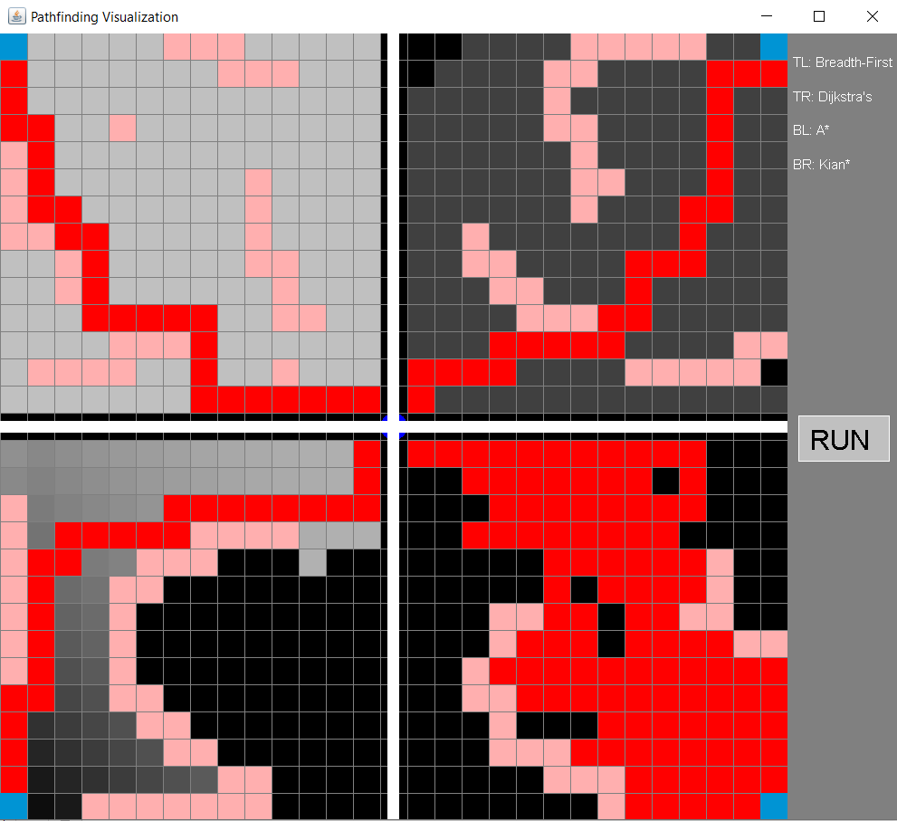

# Pathfinding Visualizer
### Watching A* work in real time.

Through a graph of tiles, users are able to watch pathfinding algorithms operate in real
time. Each algorithm occupies a separate quadrant and shades the graph as it paths to thte middle.

## Algorithms
- Dijkstra
- A*
- Breadth First Search/Flood Fill

## Technology
- Java Swing

## Contributors
- Kai T
- Kian N

## Screenshots

---

